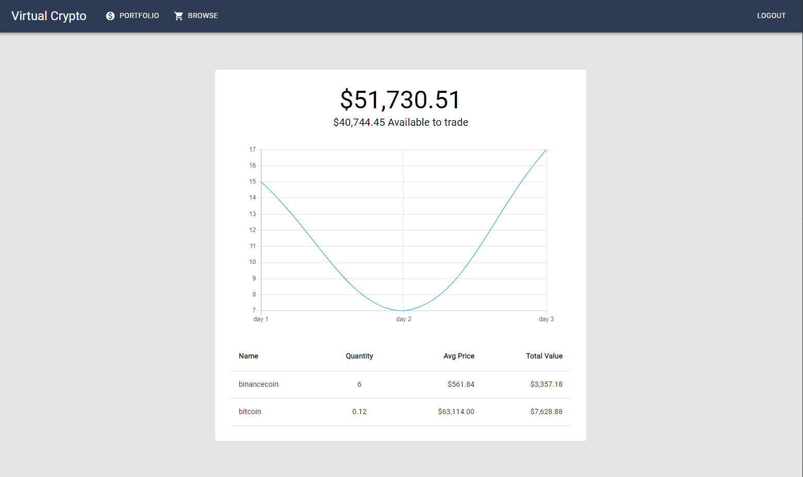
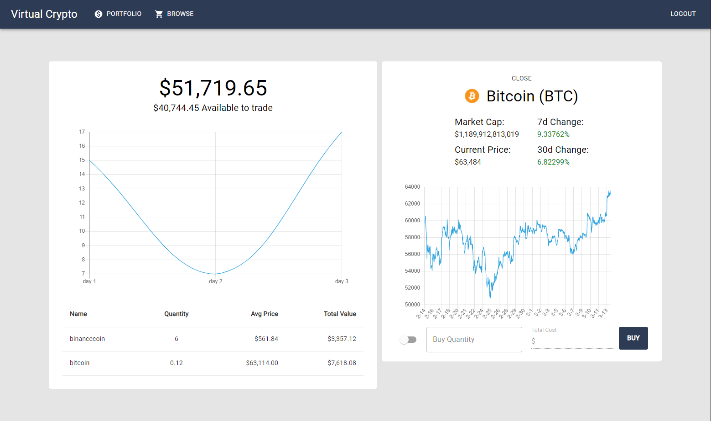
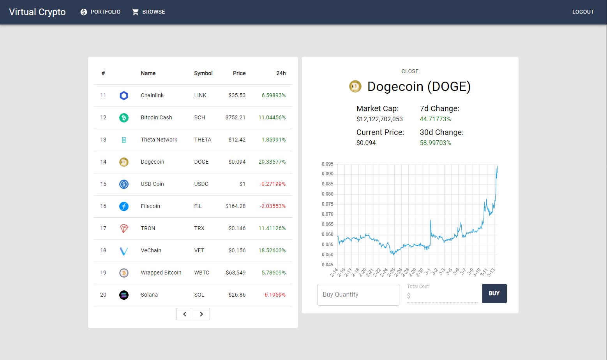

# Virtual Crypto v3

#### A virtual cryptocurrency portfolio manager that uses real time prices. Practice investing in cryptocurrency before using real money!

#### Frontend Features:
**ReactJS** as main framework. 
**React-router-dom** maintains routing. 
**Redux** manages global state around the application. 
**Axios** sends HTTP requests to third-party APIs as well as our own server. 
**Material UI** for pre-made component styling. 

#### Backend Features:
A RESTful API handles incoming requests from the frontend. 
User password is hashed with bcrypt. 
JSON Web Tokens are used to authenticate the user each time they login. 
User information is modeled by Mongoose and stored in MongoDB Atlas. 
Orders are translated into queries that update the users information. 

#### Screenshots:

## Tools Used

#### - Frontend: ReactJS
#### - Backend: NodeJS + ExpressJS
#### - Database: MongoDB
#### - Styling: Material UI!
